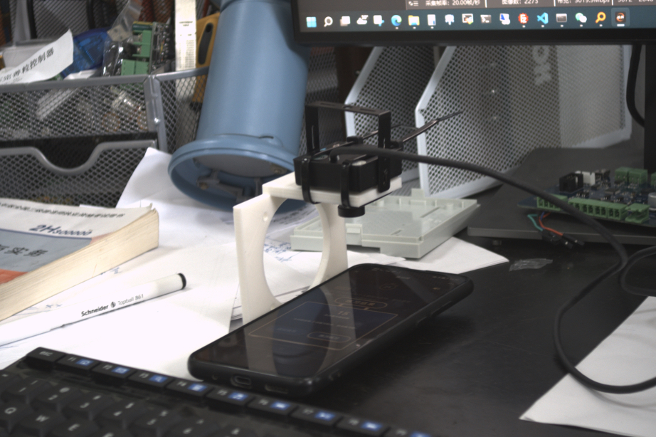
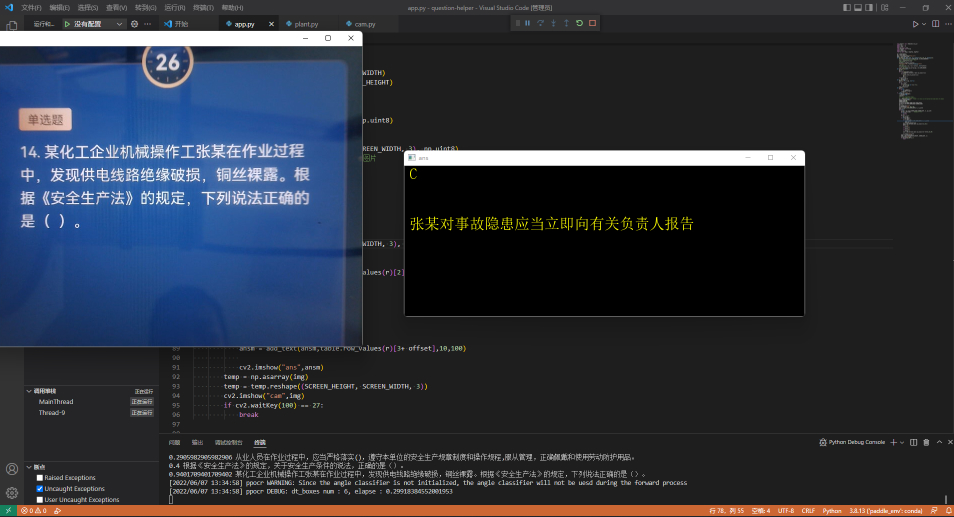

# 自动答题引擎

wvv 20220607

经常需要参加各种手机答题活动，所以半天时间做了本项目来完成自动答题，节约点答题时间。

本代码在 python3.8 + paddleocr cpu版本运行通过。

核心流程为：

通过摄像头读取屏幕图像

通过ocr引擎解析题目内容

将题目与题库进行匹配，得到答案

注意：考虑到ocr的准确性等问题，所以进行匹配的时候不能采用精确匹配模式，这里采用的是文字编辑Levenshtein算法距离进行匹配。

ocr引擎采用的paddleocr

根据paddleocr官方文档，搭建好python环境，连接好usb摄像头，就可以运行本代码了。

本代码非开箱即用，很多参数需要自己调节，仅供参考。

